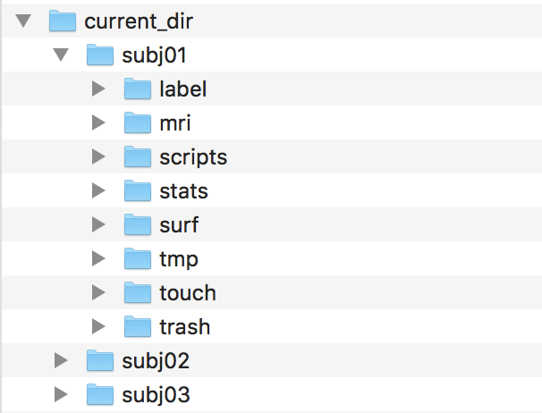
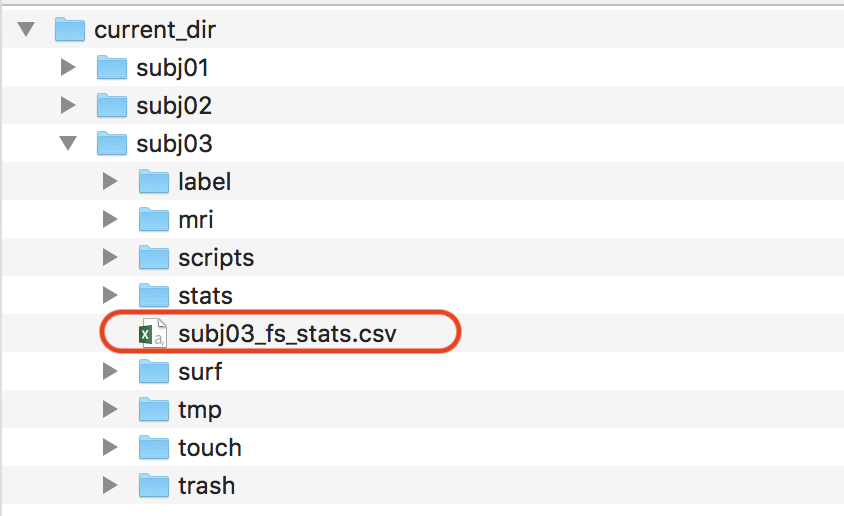
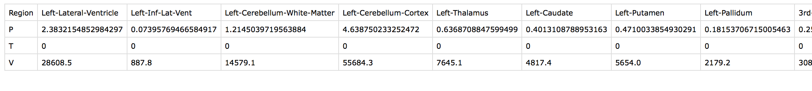

# <font size=6><br>_**fsStats.py</br></font> <font size=3>FreeSurfer Stats Extraction python script**_</font>


## Description
+ Easy extraction script of subcortical (aseg.stats) and cortical (aparc*.stats) measurements
+ Output is a table including Region name <b>(Region)</b> / ICV normalized volume <b>(V)</b> / Cortical thickness <b>(T)</b> / Native volume <b>(P)</b>
+ This script only supports FreeSurfer 6.0 and above versions (_DKT-atlas stats only_)


## How to install this script
+ <b>Download packages</b>
```
git clone https://github.com/yooha1003/fsStats.git
```
+ <b>Install modules</b>
```
python setup.py install
```

## Usage
+ <b>Run in Terminal</b>
```
python fsStats.py --subjid=subj01
```

## Example of current working directory structure


## Outputs
* <font size=4>_Stats CSV file_</font>



* <font size=4>_XX_fs_stats.csv_</font>


## Version history
+ Version 0.1: the script release (2021.09.16)

## _Contact for Feedback and Bug Reports_
_Uksu, Choi (qtwing@naver.com)_
